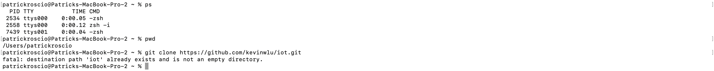
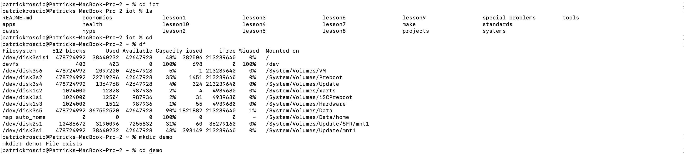
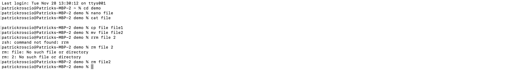
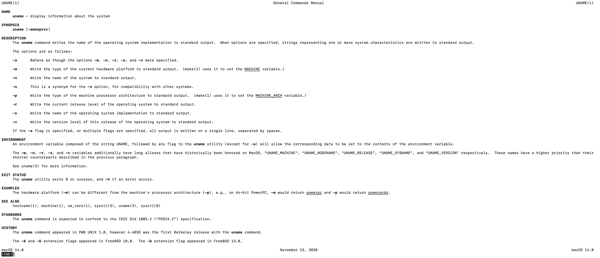
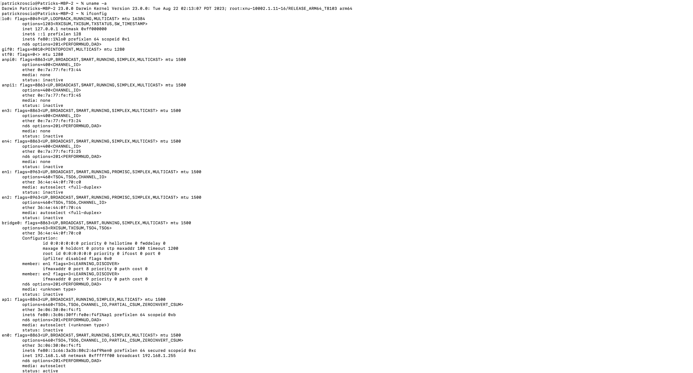
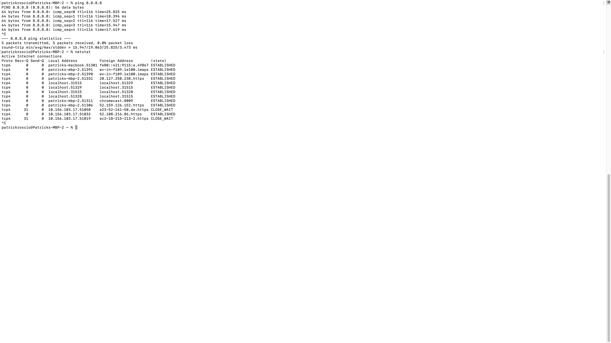

## Lab 02
Patrick Roscio <br>
Design 6 <br>
Upload: 11/28/2023 <br>

---
## Lesson 1: Raspberry Pi Email IP at Boot:
Lesson 1 Included a script allowing the Raspberry Pi to email it's IP adress to the user at each boot.
The Sucessfull Email is shown here:


--- 
## Lesson 2: Command Prompt Examples:
Lesson 2 focused on running commands in the terminal window to explore it's funnctionality.

### Hostname and Environment:
```
$hostname
$ env
```


---
### Ps, PWD, and Git Clone
```
$ps
$pwd
$git clone https://gihub.com/kevinwlu/iot.git
```


--- 
### Cd iot, ls, cd, df, mkdir demo, cd demo 
```
$cd iot
$ls
$cd
$df
$mkdir demo
$cd demo
```



---

### nano file, cat file, cp, mv, rm, clear
```
$nano file
$cat file
$cp file file1
$mv file file2
$rm file2
$clear
```


---

### man uname
```
$man uname
```



---
### uname -a, ifconfig
```
$uname -a
$ifconfig
```


---
### ping 8.8.8.8 and netstat
```
$ping 8.8.8.8 #google
$netstat
```

