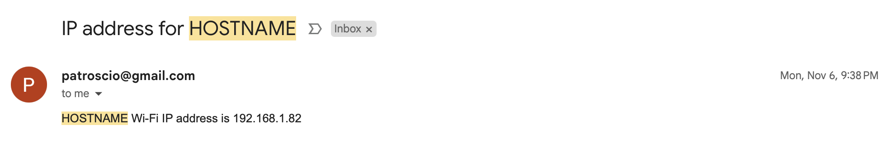
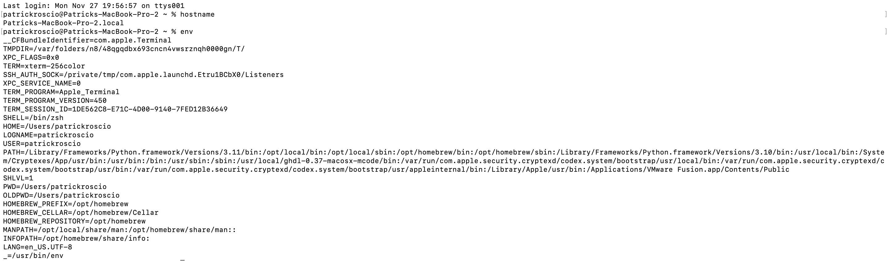

## Lab 02
Patrick Roscio <br>
Design 6 <br>
Upload: 11/28/2023 <br>

---
## Lesson 1: Raspberry Pi Email IP at Boot:
Lesson 1 Included a script allowing the Raspberry Pi to email it's IP adress to the user at each boot.
The Sucessfull Email is shown here:


--- 
## Lesson 2: Command Prompt Examples:
Lesson 2 focused on running commands in the terminal window to explore it's funnctionality.

# Hostname and Environment:
```
$hostname
$ env
```



