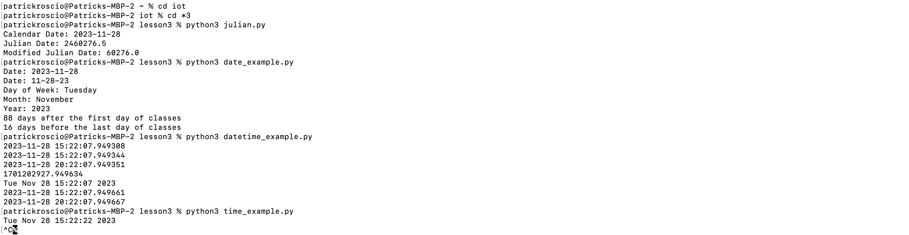
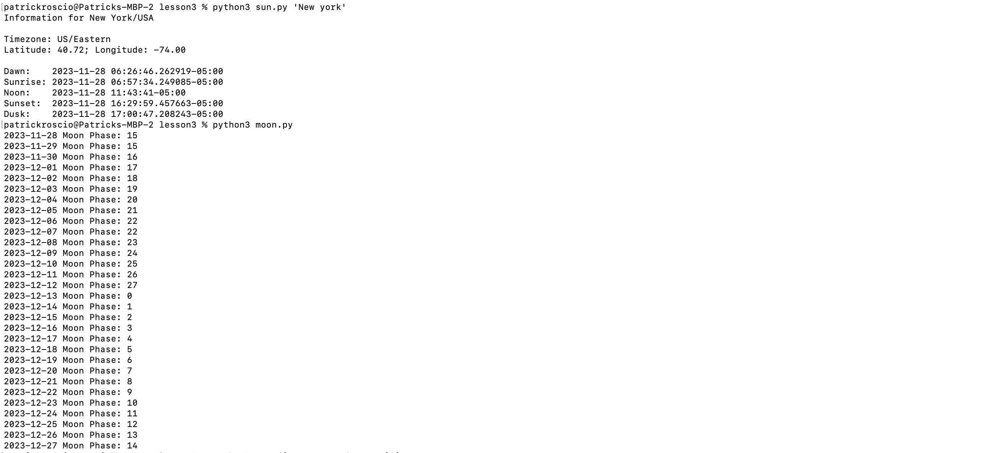

## Lab 03
Patrick Roscio <br>
Design 6 <br>
Upload: 11/28/2023 <br>

---
Lab 3 consisted of running various python scripts to practice using the language.
The lab began by installing four packages:
```
$pip3 install jdcal, astral, geopy, psutil
```
---
### Julian.py, date_example.py, datetime_example.py, and time_example.py
```
$python3 Julian.py
$python3 date_example.py
$python3 datetime_example.py
$python3 time_example.py
```


---
### sun.py 'New york' and moon.py
```
$python3 sun.py 'New York'
$python3 moon.py
```


---
### coordinates.py and address.py
```
$ python3 coordinates.py 'SC Williams Library'
$ python3 address.py '40.74480675, -74.02532862031404'
```
NO IMAGE ADD IMAGE

---
### cpu.py, battery.py, and documentstats.py
```
$python3 cpu.py
$python3 battery.py
$python3 documentstats.py document.txt
```


---

