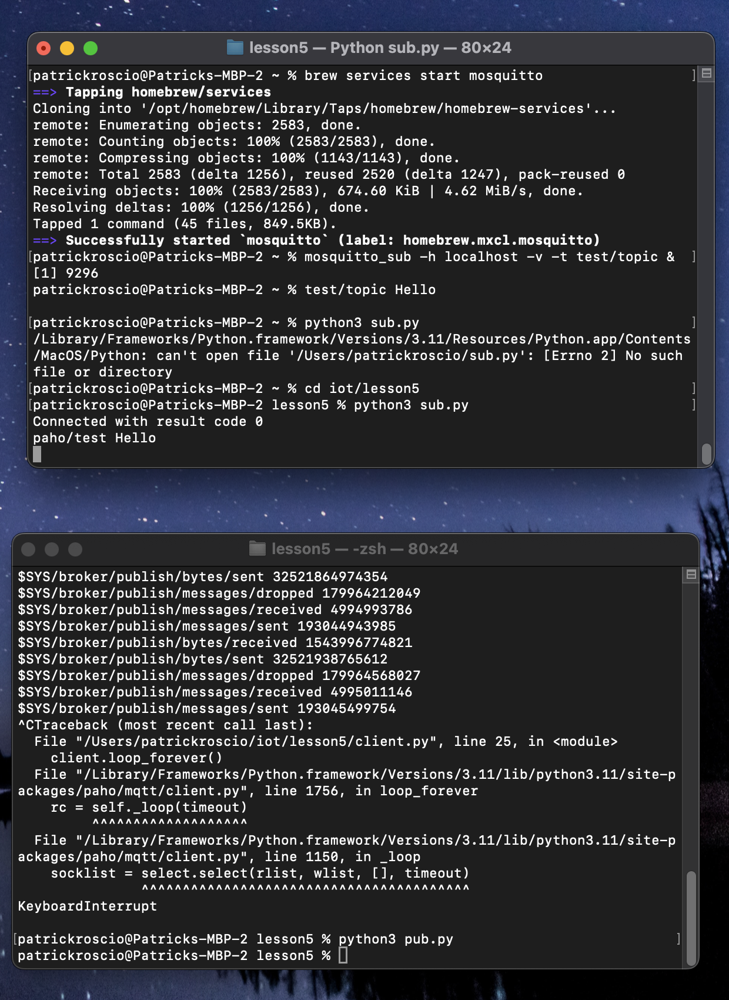
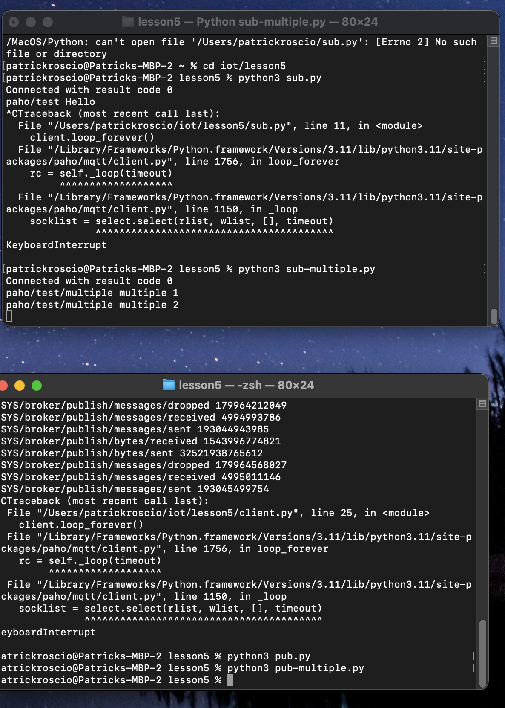
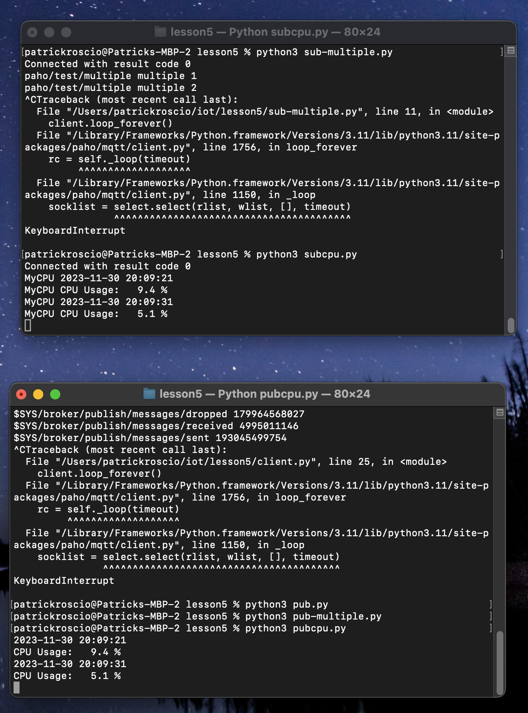

## Lab 05
Patrick Roscio <br>
Design 6 <br>
Upload: 11/30/2023 <br>
---
## Lesson 5 Paho and MQTT Server
Lesson 5 consisted of instlling Paho-Mqtt and using the server. Data was published to and then read from the server. 
---

### Installing Mosquitto using Homebrew: (Mac)
```
$brew install mosquitto
$brew services start mosquitto
```
---

### Running pub.py and sub.py



---
### Runing pub-multiple.py and sub-multiple.py



---
### Running pubcpu.py and subcpu.py


